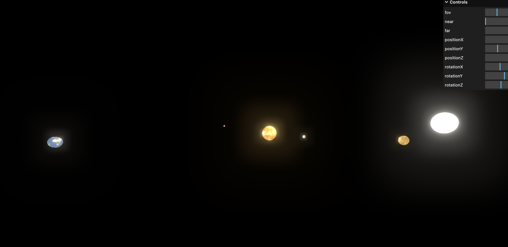

# COARV - WebGL Tutorial

Réalisé par *Anatole ROCHUT, Ruben CHRISTON - ECN - 2025*

## Bilan du Tutoriel

### Lien du tutoriel

Le tutoriel est trouvable [ici](https://threejs.org/manual/#en/fundamentals)

### Réalisation

Nous avons décidé de réaliser plusieurs parties de la section Fundamentals :

- Primitives
- Cameras
- Textures
- Lights

### Bilan du tutoriel

Le tutoriel de Three.JS est très complet et bien expliqué.
Avec nos connaissances en JavaScript et en rendu 3D, nous avons rapidement compris et maitrisé les implémentations des différentes notions.

### Améliorations proposées

Nous pensons que le tutoriel pourrait être amélioré en ajoutant plus d'informations sur les bump-maps, normal-mapss, et autres types de textures avancées.
Il pourrait aussi être intéressant de rajouter des exemples de rendus 3D plus avancés, comme des shaders personnalisés.

L'ajout de tutoriels avancés en post-processing pourrait aussi être intéressant.

### Extrapolation

Pour illustrer l'utilisation de Three.JS, nous avons décidé de réaliser un petit projet de système solaire en 3D. Nous avons utilisé une API pour obtenir les planetes (en cherchant aussi une API qui pourrait nous donner la position de chaque astre en temps réel, mais nous n'avons pas trouvé).
Nous avons donc créé un système solaire avec les planètes et le soleil, et nous avons ajouté des meshs et textures pour les planètes, en jouant avec les différents matériaux et lumières.

### Conclusion

En comparaison avec d'autres sujets de classe inversés de COARV, la partie WebGL est relativement simple et rapide à faire.
Nous pensons qu'il peut être intéressant de rajouter des parties plus avancées dans les requis, comme l'importation d'un mesh externe, ou de la VR.
